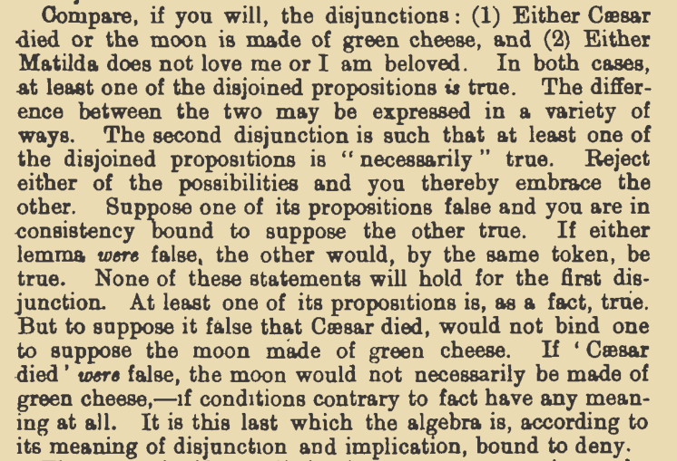

# [Week 00](https://github.com/benbrastmckie/ModalHistory/tree/master?tab=readme-ov-file#week-00-introduction-and-origins-feb-03)

This week will present an overview of the seminar before presenting the system of material implication developed in _Principia Mathematica_ and Lewis' early essays motivating the development of a logic of strict implication.

- **[pp. 91, 94-104] Russell, Bertrand, and Alfred North Whitehead. _Principia Mathematica_. 2nd ed. Vol. 1. Cambridge: Cambridge University Press, 1910.**
- **Lewis, C. I. “Implication and the Algebra of Logic.” Mind XXI, no. 84 (1912): 522–31. https://doi.org/10.1093/mind/XXI.84.522.**
- Lewis, C. I. “Interesting Theorems in Symbolic Logic.” The Journal of Philosophy, Psychology and Scientific Methods 10, no. 9 (April 1913): 239–42. https://doi.org/10.2307/2012471.
- Lewis, C. I. “The Issues Concerning Material Implication.” The Journal of Philosophy, Psychology and Scientific Methods 14, no. 13 (June 1917): 350–56. https://doi.org/10.2307/2940255.

## Course Overview

### Plan

- Introduction to philosophical logic 
- Course overview
- Readings on the paradoxes of material implication

### Philosophical Logic

- Historical development
  - Logic has developed quickly since mid 19th century
    - Followed the development of abstract algebra
    - Modal logic is a nice filter (well contained)
    - Avoiding anachronisms, e.g., truth-tables don't appear until 1921
  - Perspective (logic was not give to us by god)
    - Good theories (strong and simple)
    - Success story (real philosophical progress)
    - Modal logic has been hugely influential
  - There are other versions of this course that start earlier
    - We are starting where we are to follow the birth of a methodology
- Formal methodology
  - Contrast philosophical logic with:
    - Mathematical logic
    - The philosophy of logic
  - Conceptual engineering
    - Proof theory
    - Model theory
    - Formal Verification
  - Logic as science?
    - General and repeatable methods 
    - Productive programs with a lot to show (e.g., CS, linguistics)
    - The risk is dogmatism (rigidity of a paradigm)
- Course goals
  - Unravel the recent origins of modal logic
  - Gain familiarity with modal logic
  - Learn the methods that have supported its development
  - Build perspective towards developing new theories
- There is a lot we won't cover in the seminar meetings
  - Further applications (philosophy, linguistics, CS)
  - Broad range of technical results

### Four Modules

- Module 1: Modal Logic
  - Paradoxes of the material conditional
  - Early proof systems (1912 - 1932)
  - Quantified modal logic (1943 - 1953)
    - NOTE: interaction of existing systems
- Module 2: Intensional Semantics
  - Carnap and Kripke (1946 - 1963)
  - Prior and Thomason (1967, 1970)
  - Montague and Kaplan (1973, 1989)
  - Bimodal logics
    - NOTE: interaction of existing systems
- Module 3: Counterfactual Conditionals
  - Similarity and imposition (1967 - 1979, 2012)
  - Task semantics for tensed counterfactuals
    - NOTE: interaction of existing systems
  - Programmatic semantics
- Module 4: Constitutive Explanation
  - Subject-matter and relevance
  - 'Necessary for' and 'Sufficient for'
    - NOTE: compare to material and strict implication

### Course Requirements

- Historical Track
  - [80%] Write a final term paper (5k words)
    - Historical or contemporary
  - [10%] Presentation
    - Lead discussion on a paper or present a special topic
    - Revising the class notes for that week
  - [10%] Open (at least) five [issues](https://github.com/benbrastmckie/ModalHistory/issues)
    - Raise a substantial question or make an observation
    - Answer a question or otherwise engage with an existing issue
    - Include issue links along with your term paper for review
- Formal Track
  - [40%] Make substantial contributions to all eight collaborative problem sets
  - [40%] Complete and present a final project by either:
    - Presenting and discussing an important formal result
    - Using the model-checker to implement a semantics
  - [10%] Present a topic in class (ditto above)
  - [10%] Open (at least) five [issues](https://github.com/benbrastmckie/ModalHistory/issues)
- Logic Background
  - I will be revising the [Logic Notes](https://github.com/benbrastmckie/LogicNotes) for this course
  - These will be gather the formal systems we will be working with in a uniform notation
  - Important for the problem sets but will not be the focus of seminar meetings
  - There are links for further reading and I'll put together a bibliography for additional study

### Course Materials

- Public repository
  - Syllabus
  - Bibliography
  - Class notes
  - Issues
- Private repository
  - Readings
  - Problem sets
- Tools (_formal track_)
  - Set up a text editor for using the [model-checker](https://github.com/benbrastmckie/ModelChecker)
    - Details are provided for using VSCodium
    - Install LaTeX if you have not already done so
    - I recommend using Zotero to collect readings for this course
  - Use Git to contribute to problem sets
    - VSCodium/VSCode makes this very easy

## Lecture Notes

- Proof Theory
  - Axioms and rules stated in a formal language
  - Stipulates how to reason in that language
  - Need not correspond to anything in natural language
    - Might be worried if it did describe (idealized) reasoning in natural language
    - Not clear what constitutes the target for reasoning in natural language
    - Presumably we have not always reasoned in the ways we do now in English
    - A purely descriptive project misses the opportunity to engineer new ways of reasoning
    - Formal reasoning isn't better overall, but can be better for certain theoretical applications
- The "system of material implication" from _Principia Mathematica_ (PM) is the principle example
- Lewis' "system of strict implication" is suggested as an alternative/extension
  - **Question:** What reasons does Lewis provide for preferring his system to PM?

### _Principia Mathematica_

- **[pp. 91, 94-104] Russell, Bertrand, and Alfred North Whitehead. _Principia Mathematica_. 2nd ed. Vol. 1. Cambridge: Cambridge University Press, 1910.**

- [p.91] Aim is to axiomatize $\neg, \vee, \wedge$, and $\rightarrow$ where the latter two may be defined.
- Explicitly compositional and recursive, producing new propositions from old.

- [p.94] Aim is to describe the "ordinary procedure of deduction."
- Properties aim to be "sufficient for all common forms of inference" but not need not be "_necessary_, and it is possible that the number of them might be diminished."
- Formalism is a safeguard against "unconscious assumptions", but "it is hard to be sure that one never uses some principle unconsciously."

- [p.95] Every system must posit primitives.
- Primitives can be described though this is bound to be circular.
- For instance, specifying how to reason with primitive terms is such an example.

- [p.98] The definition is defended as being "very much more convenient for our purposes than any of its rivals"
- Warrants _modus ponens_ since 'What is implied by a true proposition is true.'
- This property leaves open what is "implied by a false proposition".
- Convenient to also say "if either $p$ is false or $q$ is true, then ' $p$ implies $q$' is to be true."
- The definition of material implication $p \rightarrow q := \neg p \vee q$.
- Slips into using modal language, claiming "if $p$ is true, $q$ _must_ be true."

- [p.99] Contrasts $p, p \rightarrow q \vdash q$ with $p \rightarrow [(p \rightarrow q) \rightarrow q]$
- Cannot express the principle symbolically (in the "object language")
- Predates the object-language/metalanguage distinction (Taski 1933)

- [p.100] "\*1.11 (_modus ponens_) is used in every inference from one asserted propositional function to another."

- [p.100] Examples of primitive propositions.

- [p.103] 2.02: $q \rightarrow (p \rightarrow q)$ "a true proposition is implied by any proposition"
- This "principle of simplification" is latter called a "paradox of material implication"

 2.21 $\neg p \rightarrow (p \rightarrow q)$ "a false proposition implies any proposition"

### "Implication and the Algebra of Logic" 

> Lewis, C. I. “Implication and the Algebra of Logic.” Mind XXI, no. 84 (1912): 522–31. https://doi.org/10.1093/mind/XXI.84.522.

- [p.522] The meaning of 'implies' is artificial (stipulated).
- Difference between "algebraic and the ordinary meanings of implication" is not always observed.
- "One may suspect that some of them would deny the divergence, or at least would maintain that the technical use is preferable and ought generally to be adopted."

- Definition: $p \rightarrow q := \neg p \vee q$
  - Cites PM for the definition.
  - Turns to focus on how the primitive notion of disjunction is to be interpreted.
  - Sets aside exclusive reading of disjunction.

- [p.523] Aims to distinguish the "Aristotelian" reading from the algebraic
- Note the counterfactual characterization.

- The differences is whether or not the disjunction holds of necessity.

- [p.524] Intensional disjunctions are said to have a "purely logical or formal character".

- Introduces intensional/extensional distinction by appealing to whether it can be "known apart from the facts" (_a priori_).
- Smith example makes possibilities very close to situations (known or otherwise).
- Does not contrast what we would call logical possibilities today, i.e., non-standard interpretations.

- Characterizes disjunction as a "logical relation of propositions".
- By contrast, the negation of the extensional reading negates both disjuncts.
- [p.525] "The meaning of disjunction in the algebra of logic must consistently be confined to the extensional," since $\neg(p \vee q) := \neg p \wedge \neg q$.
- "Every intensional disjunction is also extensional, or, more accurately, the intensional disjunction of p and q implies their extensional disjunction also. But the reverse does not hold."

- [p.526] Intensional disjunctions are explicitly characterized as _a priori_
- Extensional disjunction is said to concern actuality as opposed to possibilities.

- Strict implication is introduced as the intensional disjunction $\neg p \vee q$.
- [1] "We may call this kind of implication 'strict' at least in the sense that its meaning it narrower than that of the algebraic implication."
- [p.528] "[T]he proof that a false proposition implies any proposition is short and easy."
  - $p \rightarrow (p \vee q)$ by addition
  - $\neg p \rightarrow (\neg p \vee q)$ by substituting $\neg p$ for $p$
  - $\neg p \rightarrow (p \rightarrow q)$ by definition of $\rightarrow$
- [p.528] "The proof that a true proposition implies any proposition requires one additional principle--- that disjunctions are reversible,"
  - $p \rightarrow (p \vee q)$ by addition
  - $p \rightarrow (q \vee p)$ by the commutativity of disjunction
  - $p \rightarrow (\neg q \vee p)$ by substituting $\neg q$ for $q$
  - $p \rightarrow (q \rightarrow p)$ by definition of $\rightarrow$

- [p.529] Testing of hypotheses requires a stronger connection between propositions than material implication.
- Explicit concern with the logical consequences of "contrary-to-fact" propositions.
- The "ordinary" and "proper" use of 'implies' can draw consequences from contrary-to-fact propositions.

- Material implication does not accord with any "ordinary or useful meaning".
- [p.530] A more useful definition than material implication is possible.
- The non-Euclidean geometry comparison does not land (prior to the development of GR).

- Although the method of "the algebra of logic" is perfectly appropriate, the present form of the calculus of propositions inadequate.
- The principle of addition $p \rightarrow (p \vee q)$ must be dropped since (anachronistically) an intensional reading is equivalent to: $\Box(p \rightarrow \Box(p \vee q))$.
- In addition to removing this principle, conjunction cannot be defined as $p \wedge q := \neg(\neg p \vee \neg q)$ but rather must be taken to be primitive.
- Or that is one way to go...

- [p.531] Or we could extend the system of material implication to also include intensional disjunction.
- Conjunction could be defined as before while also being able to define strict implication.
- The meaning of strict implication is claimed to be "precisely that of ordinary inference and proof."

### "Interesting Theorems in Symbolic Logic"

> Lewis, C. I. “Interesting Theorems in Symbolic Logic.” The Journal of Philosophy, Psychology and Scientific Methods 10, no. 9 (April 1913): 239–42. https://doi.org/10.2307/2012471.

- [p.241] Provides a list of theorems that demonstrate, "the divergence of the meaning of "implies" in the algebra of logic from the "implies" of valid inference." 
- Claims that the calculus of propositions grew out the calculus of classes, where this explains why these these theorems have been incorporated.
- [p.241-2] "In the algebra of classes, 'all a is b' may be interpreted, 'all cases of are cases of b,' or 'all cases in which p is true are cases in which q is true,'--- hence, finally 'p implies q.'"

### "The Issues Concerning Material Implication"

> Lewis, C. I. “The Issues Concerning Material Implication.” The Journal of Philosophy, Psychology and Scientific Methods 14, no. 13 (June 1917): 350–56. https://doi.org/10.2307/2940255.

- [p.351] "There is no sound reason why we should abandon our usual meaning of 'implies' for this unusual one."
- "In any system of material implication, the theorems which we have spoken of as 'peculiar' admit of valid use as premises. But they can not profitably be used as rules of inference, either within or outside of the system. "
- "[T]hese 'peculiar' theorems give such propositions as, 'To-day is Monday implies 2 + 2 = 4,' and 'Socrates was a solar myth, implies that to-day is Monday.'"
  - The former may also be said to be a paradox of strict implication (not the best example).
- [p.352] "The above theses are sufficient to establish the fact that the system of material implication is defective, in this sense: it contains any number of theorems--- theorems about 'implication'--- which can never be of the slightest value as principles of inference."
- [p.353] Deduction is glossed as logically necessity.
- [p.354] "whether the postulates are true or not, if you _grant_ the postulates, you must grant the theorems."
- [p.355] "whether the postulates of material implication are, in fact, true or not, if they were true, the theorems would necessarily be true?"
- "But if Socrates were a solar myth, would it be true that 2 + 2 = 5? If you granted some paradoxer his assumption that Socrates was a solar myth, would you feel constrained to go on and grant that 2 + 2 = 5 ?"
- Discusses relevance of the postulates used to establish a theorem.
- [p.356] "when you say that the theorems are not demonstrated, all you mean is that they are not shown to be relevant in content to the postulates?"
- "For a relation which does not indicate relevance of content is merely a connection of 'truth values,' not what we mean by a "logical" relation or 'inference.'"
