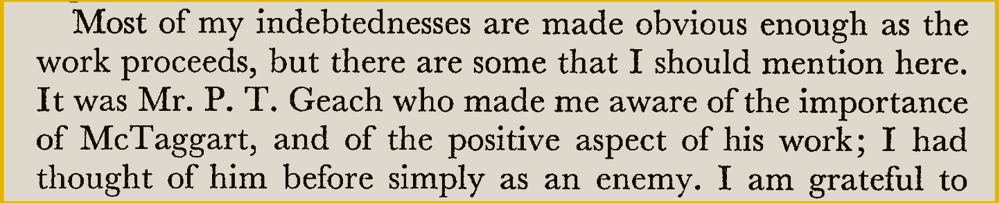
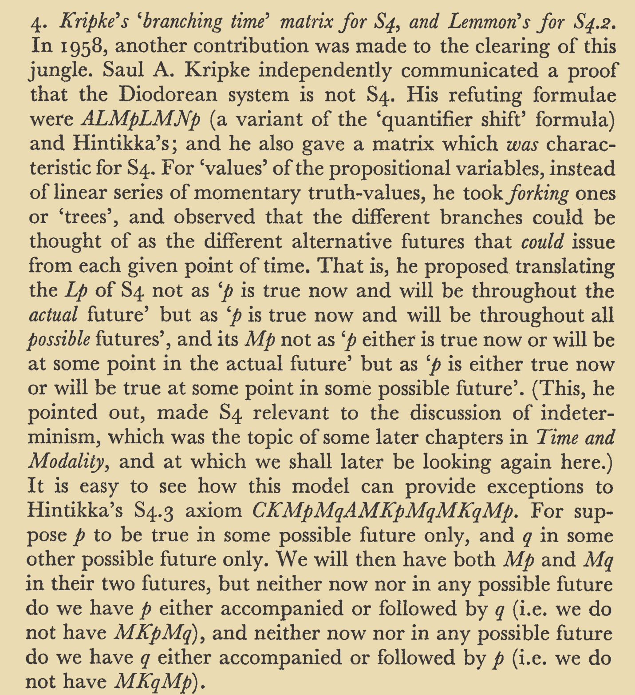
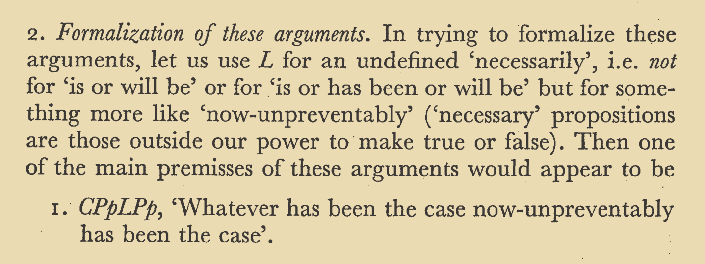
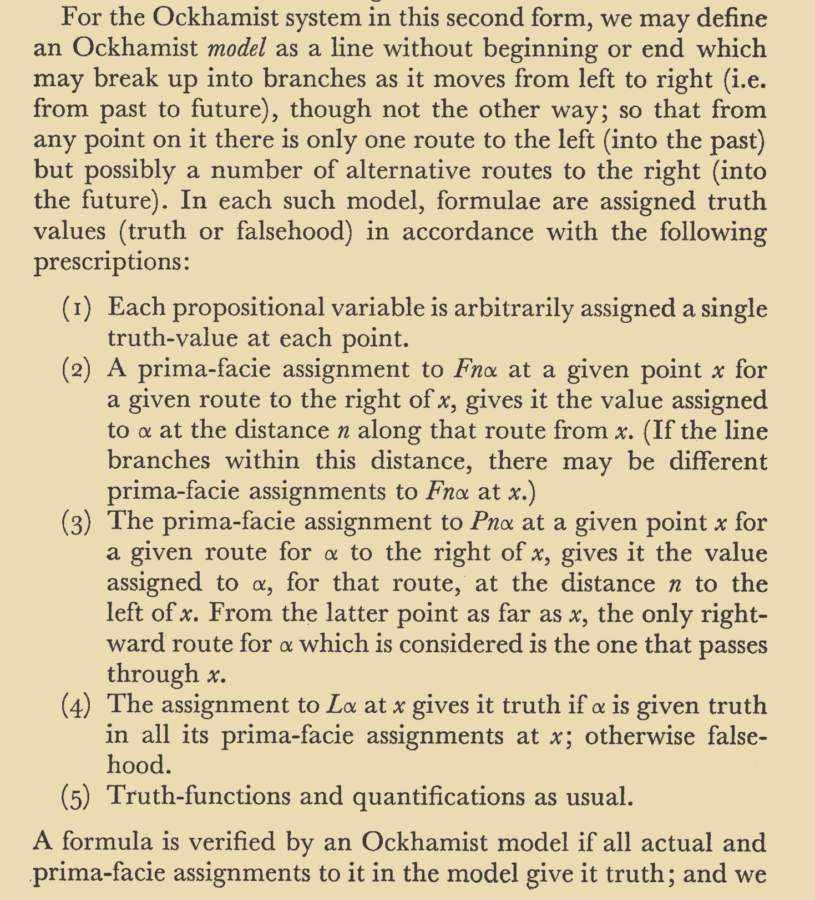
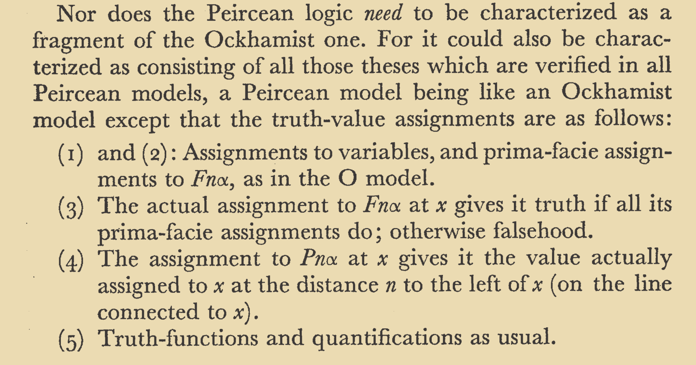

# [Week 04](https://github.com/benbrastmckie/ModalHistory/tree/master?tab=readme-ov-file#week-04-prior-and-thomason-mar-3)

- Prior, Arthur N. Time and Modality. Westport, Conn.: Greenwood Press, 1955.
- Prior, Arthur N. Past, Present and Future. Oxford, New York: Oxford University Press, 1967.
- **Thomason, Richmond H. “Indeterminist Time and Truth-Value Gaps.” Theoria 36, no. 3 (1970): 264–81. https://doi.org/10.1111/j.1755-2567.1970.tb00427.x.**

## Presentations

### Kripke Letters

> What are Kripke's suggestions in his correspondence with Prior?

- Kripke, Saul A. “Letter from Saul Kripke to A. N. Prior, Sept. 3, 1958,” September 3, 1958.
- ———. “Letter from Saul Kripke to A.N. Prior, Oct. 13, 1958,” October 13, 1958.
- Øhrstrøm, Peter, Henrik Schärfe, and Thomas Ploug. “Branching Time as a Conceptual Structure.” In Conceptual Structures: From Information to Intelligence, edited by Madalina Croitoru, Sébastien Ferré, and Dickson Lukose, 125–38. Berlin, Heidelberg: Springer, 2010. https://doi.org/10.1007/978-3-642-14197-3_14.

### Thomason's Reconstruction

> Sketch Thomason's Priorian account of tense logic.

### McTaggart's Puzzle

> Present McTaggart's argument that time is not real.

- McTaggart, J. Ellis. “The Unreality of Time.” Mind XVII, no. 4 (1908): 457–74. https://doi.org/10.1093/mind/XVII.4.457.
- Øhrstrøm, Peter. “Time and Logic: A.N. Prior’s Formal Analysis of Temporal Concepts.” In Formal Concept Analysis, edited by Sébastien Ferré and Sebastian Rudolph, 66–81. Berlin, Heidelberg: Springer, 2009. https://doi.org/10.1007/978-3-642-01815-2_6.

### Prior's _Past, Present, and Future_

- Prior (1967, p. vi) credits Geach for making him aware of the importance of McTaggart's work on time.

- Prior (1967, p. 20) sets out the Polish notation that he uses.

- Prior (1967, p. 27) credits Kripke for his branching time matrix for S4.
- Kripke's formula $\Box\Diamond p \vee \Box\Diamond\neg p$
- "p is true now and will be throughout the _actual_ future"
- "p is true now and will be throughout all _possible_ futures"
- Hintikka's formula $(\Diamond p \wedge \Diamond q) \rightarrow (\Diamond(p \wedge \Diamond q) \vee \Diamond(q \wedge \Diamond p))$.

- Prior (1967, p. 117) introduces 'now-unpreventably'.

- Prior (1967, p. 126) provides the Ockhamist semantics.

- Prior (1967, p. 132) provides the Peircean semantics:

