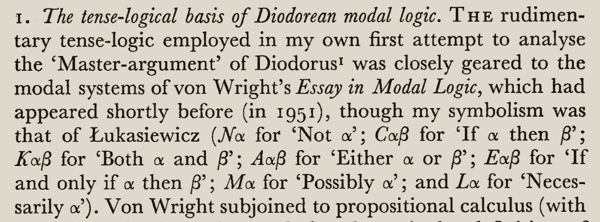

# [Week 04](https://github.com/benbrastmckie/ModalHistoryPrivate?tab=readme-ov-file#module-2-intensional-semantics)

- Prior, Arthur N. Time and Modality. Westport, Conn.: Greenwood Press, 1955.
- Prior, Arthur N. Past, Present and Future. Oxford, New York: Oxford University Press, 1967.
- **Thomason, Richmond H. "Indeterminist Time and Truth-Value Gaps." Theoria 36, no. 3 (1970): 264–81. https://doi.org/10.1111/j.1755-2567.1970.tb00427.x.**

## Presentations

- McTaggart
- Linear Semantics
- Kripke Letters
- Prior on Indeterminism
- Thomason's Semantics

### Kripke Letters

> What are Kripke's suggestions in his correspondence with Prior?

- Kripke, Saul A. "Letter from Saul Kripke to A. N. Prior, Sept. 3, 1958," September 3, 1958.
- ———. "Letter from Saul Kripke to A.N. Prior, Oct. 13, 1958," October 13, 1958.
- Øhrstrøm, Peter, Henrik Schärfe, and Thomas Ploug. "Branching Time as a Conceptual Structure." In Conceptual Structures: From Information to Intelligence, edited by Madalina Croitoru, Sébastien Ferré, and Dickson Lukose, 125–38. Berlin, Heidelberg: Springer, 2010. https://doi.org/10.1007/978-3-642-14197-3_14.

### Thomason's Reconstruction

> Sketch Thomason's Priorian account of tense logic.

### McTaggart's Puzzle

> Present McTaggart's argument that time is not real.

- McTaggart, J. Ellis. "The Unreality of Time." Mind XVII, no. 4 (1908): 457–74. https://doi.org/10.1093/mind/XVII.4.457.

### Prior on McTaggart

> Present Prior's analysis of McTaggart's account

- Øhrstrøm, Peter. "Time and Logic: A.N. Prior's Formal Analysis of Temporal Concepts." In Formal Concept Analysis, edited by Sébastien Ferré and Sebastian Rudolph, 66–81. Berlin, Heidelberg: Springer, 2009. https://doi.org/10.1007/978-3-642-01815-2_6.

### McTaggart

- Prior (1967, p. vi) credits Geach for making him aware of the importance of McTaggart's work on time.
- McTaggart, J. Ellis. "The Unreality of Time." Mind XVII, no. 4 (1908): 457–74. https://doi.org/10.1093/mind/XVII.4.457.
- Øhrstrøm, Peter. "Time and Logic: A.N. Prior's Formal Analysis of Temporal Concepts." In Formal Concept Analysis, edited by Sébastien Ferré and Sebastian Rudolph, 66–81. Berlin, Heidelberg: Springer, 2009. https://doi.org/10.1007/978-3-642-01815-2_6.

### Prior (1955) _Time and Modality_ 

> Prior (1967, p. 20) sets out the Polish notation that he uses (also used in 1955 and so relevant here).

- Prior suggests that the following matrix is characteristic of S4:
-

- Matrices as proto-semantics
- Give a modern articulation

### Kripke Letters

- Kripke, Saul A. "Letter from Saul Kripke to A. N. Prior, Sept. 3, 1958," September 3, 1958.

- $\Box\Diamond p \vee \Box\Diamond\neg p$ is valid on Prior's early system but invalid in S4
- There is an S4 countermodel

- $\Box p \rightarrow p$
- $\Box p \rightarrow \Box\Box p$
- $\Box(p \rightarrow q) \rightarrow (\Box p \rightarrow \Box q)$
- $(\Diamond p \wedge \Diamond q) \rightarrow (\Diamond(p \wedge \Diamond q) \vee \Diamond(q \wedge \Diamond p))$
  - There is an S4 countermodel to the final principle

- ———. "Letter from Saul Kripke to A.N. Prior, Oct. 13, 1958," October 13, 1958.
- Øhrstrøm, Peter, Henrik Schärfe, and Thomas Ploug. "Branching Time as a Conceptual Structure." In Conceptual Structures: From Information to Intelligence, edited by Madalina Croitoru, Sébastien Ferré, and Dickson Lukose, 125–38. Berlin, Heidelberg: Springer, 2010. https://doi.org/10.1007/978-3-642-14197-3_14.

### Indeterminism in Prior's _Past, Present, and Future_

- Prior (1967, p. 27) credits Kripke for his branching time matrix for S4.
  - Kripke's formula $\Box\Diamond p \vee \Box\Diamond\neg p$
  - Hintikka's formula $(\Diamond p \wedge \Diamond q) \rightarrow (\Diamond(p \wedge \Diamond q) \vee \Diamond(q \wedge \Diamond p))$.
- Towards a Piercian reading
  - From "p is true now and will be throughout the _actual_ future"
  - To "p is true now and will be throughout all _possible_ futures"

- Prior (1967, p. 117) introduces 'now-unpreventably'.

- Prior (1967, p. 126) provides the Ockhamist semantics.

- Prior (1967, p. 132) provides the Peircean semantics:

### Thomason's Reconstruction

- Linear Semantics makes the future closed
- Peircian semantics make $Fp \vee F\neg p$ invalid.
  - Also $PFp$ would not be a logical consequence of $p$.
  - [p.270] "When all is said and done, the basic issue here seems to be whether or not one is prepared t o accept as meaningful the assertion that there is always, whether we know it or not, a single possible future which, from the perspective of a given time will be its actual future."
- Inevitability
  - Comes apart from truth even though $p \vDash Lp$ and $Lp \vDash p$.
  - Consider any fork, replacing $p$ with a $Fp$.
- Truth-Value gaps
  - [p.276] "In our semantic theory this difference between supposing that P will be and supposing that it is now true that P will be is represented by the difference between making FP an antecedent of an implication as in 6.5 and making it a premiss of the consequence relation as in 6.3."
  - [p.280] "Notions which are particularly worth studying in this way are knowledge, mentioned above, and obligation. A mixed temporal-epistemic language, for instance, is particularly useful for explaining the behavior of the English word 'might,' which displays temporal as well as epistemic traits. A semantic interpretation of conditionals can be added t o tense logics such as the one described here by adding selection functions df the kind described in [4] to models."

<!-- - See the [Logic Notes](https://github.com/benbrastmckie/LogicNotes/blob/main/LogicNotesCurrent.pdf) to follow along. -->